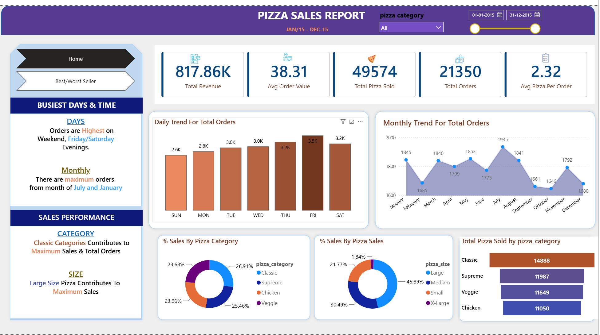
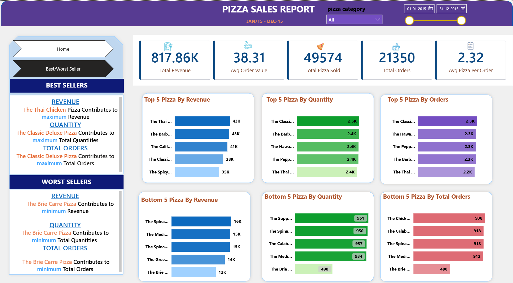

# 🍕 Pizza Sales Data Analysis

## 📌 Project Overview

This project analyzes pizza sales data to understand overall business performance, customer preferences, and product-level sales performance.

The analysis was performed using SQL for data analysis and Power BI for interactive data visualization.

## 🎯 Business Objectives

The main objective of this project is to analyze pizza sales data and answer key business questions related to revenue, orders, quantities sold, pizza categories, pizza sizes, and product performance.

## 📊 Key Performance Indicators (KPIs)

- Total Revenue
- Average Order Value
- Total Pizzas Sold
- Total Orders
- Average Pizzas Per Order

## 📈 Analysis Performed

- Sales performance by pizza size
- Sales performance by pizza category
- Daily order trends
- Monthly order trends
- Top 5 best-selling pizzas
- Bottom 5 worst-selling pizzas
- Pizza performance based on revenue
- Pizza performance based on total quantity sold
- Pizza performance based on total orders

## 🔍 Key Insights

- Identified the highest and lowest performing pizza categories.
- Analyzed daily and monthly order trends.
- Identified the best and worst-selling pizzas based on revenue, quantity, and total orders.
- Analyzed sales performance by pizza size.
- Identified peak ordering days and months.

## 🛠️ Tools & Technologies

- SQL
- Power BI

## 📂 Project Structure


```text
Pizza-Sales-Data-Analysis/
│
├── 01_Problem_Statement/
│   └── Pizza_Sales_Problem_Statement.docx
│
├── 02_Dataset/
│   └── Pizza_Sales_Dataset.xlsx
│
├── 03_SQL_Analysis/
│   └── Pizza_Sales_SQL_Queries.docx
│
├── 04_PowerBI_Dashboard/
│   └── Pizza_Sales_Dashboard.pbix
│
└── README.md
```
## 📊 Power BI Dashboard

### Sales Overview



### Best & Worst Sellers


